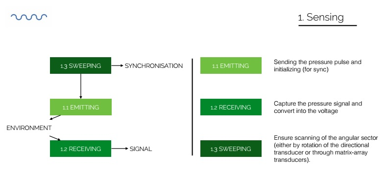

# Function

## Name
[`FCT-sensing`]()

## Title
Sensing

## Description
Emission and reception of the acoustic wave (convert voltage V to pressure P and vice versa). Producing high voltage pulses (Dirac)
