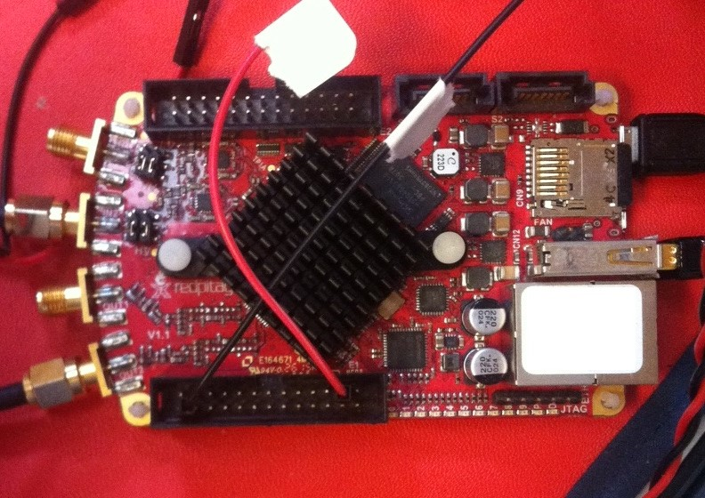

# Module

## Name
[`MDL-adc_redpitaya`]()

## Title
Analogic to digital conversion using RedPitaya  

## Version
V16.04.15 

## Technology
Commercial board [`RedPitaya`](http://redpitaya.com/)

## Functions  
[`FCT-signal_processing_adc`](../../functions/FCT-signal_processing_adc)  

## IOs
###Inputs
[`ITF-E_signal_envelope`](../../interfaces/ITF-E_signal_envelope)  
[`ITF-B_5v`](../../interfaces/ITF-B_5v)  

### Outputs
digital signal

## Information

### Module requirements 
The response of the transducer is analog,
in order to process it with a microcontroler we nedd to convert it into a digital form.

### Visuals
[`The RedPitaya board as 125MHz ADC`](http://wiki.redpitaya.com/index.php?title=Hardware_Overview)

### Observations

#### Pros
relatively easy to use
#### Cons
expensive board
slow
only need the ADC and wifi, not the rest of the board
#### Constraints
need 5V, 2A power supply

