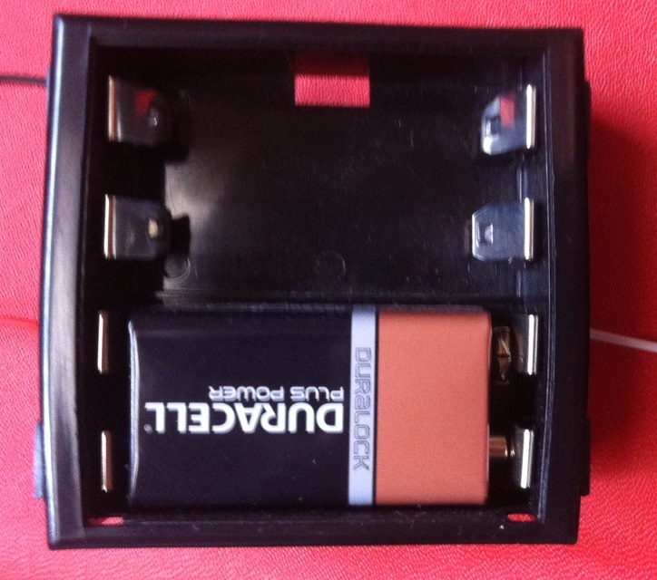

# Module

## Name
[`MDL-alimentation_battery`]()

## Title
Alimentation

## Version
V16.04.18 

## Technology
Echopen Made using two 9V batteries serially connected

## Functions  
[`FCT-sensing`](../../functions/FCT-sensing)  
[`FCT-user_interfacing`](../../functions/FCT-user_interfacing)  

## IOs
###Inputs
None

### Outputs
[`ITF-L_18v_alimentation`](../../interfaces/ITF-L_18v_alimentation)  variable stabilized power supply (0 to 30V).

## Information

### Module requirements 
This module will provide DC voltage to the circuit.

### Visuals

### Observations

#### Pros
simple, low noise
#### Cons
NA  
#### Constraints
fixe 18V output

