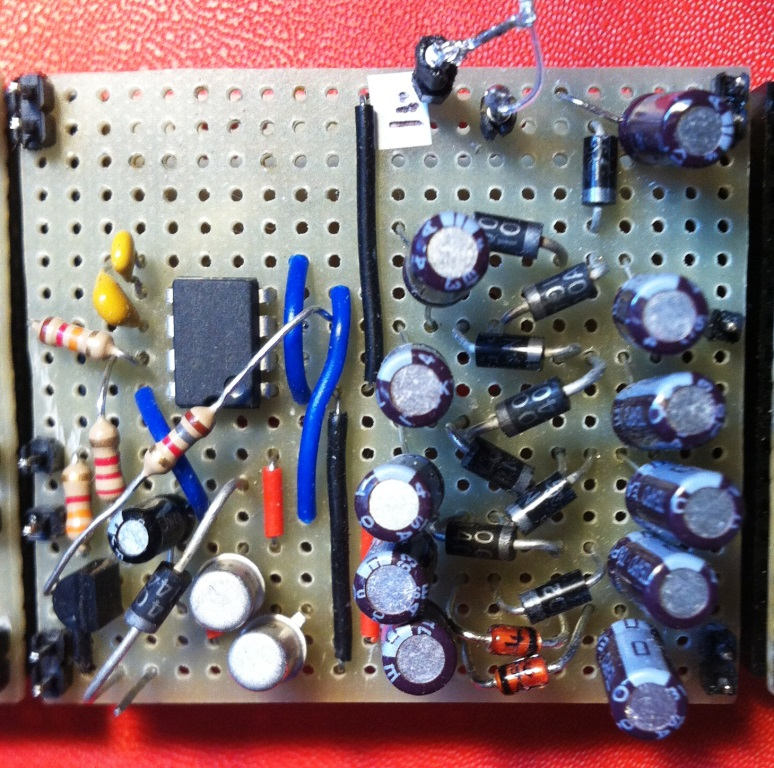

# Module

## Name
[`MDL-alimentation_high_voltage_cockroft`]()

## Title
High voltage (-100V) alimentation

## Version
V16.04.11 

## Technology
Echopen Made

## Contributor
[`Jérôme`](../../contributors/CTB-jerome)  
[`Gérard`](../../contributors/CTB-gerard)  

## Functions  
[`FCT-sensing_emitting`](../../functions/FCT-sensing_emitting)  

## IOs
###Inputs
[`alimentation +5V`](../../interfaces/ITF-B_5v)  
[`alimentation +18V`](../../interfaces/ITF-L_18v_alimentation)  

### Outputs
[`-100V DC`](../../interfaces/IM_A_100v)  

## Information

### Module requirements 
This module will provide a high negative DC voltage (-100V) in order to increase the pulse voltage to exite efficiently the transducer.

### Visuals
  
*circuit*    
  
*square alimentation 0-18V*

### Observations

#### Pros
low electromagnetic scatterred field  
#### Cons
low intensity  
#### Constraints
alternative signal (square) 0 to -15V input

