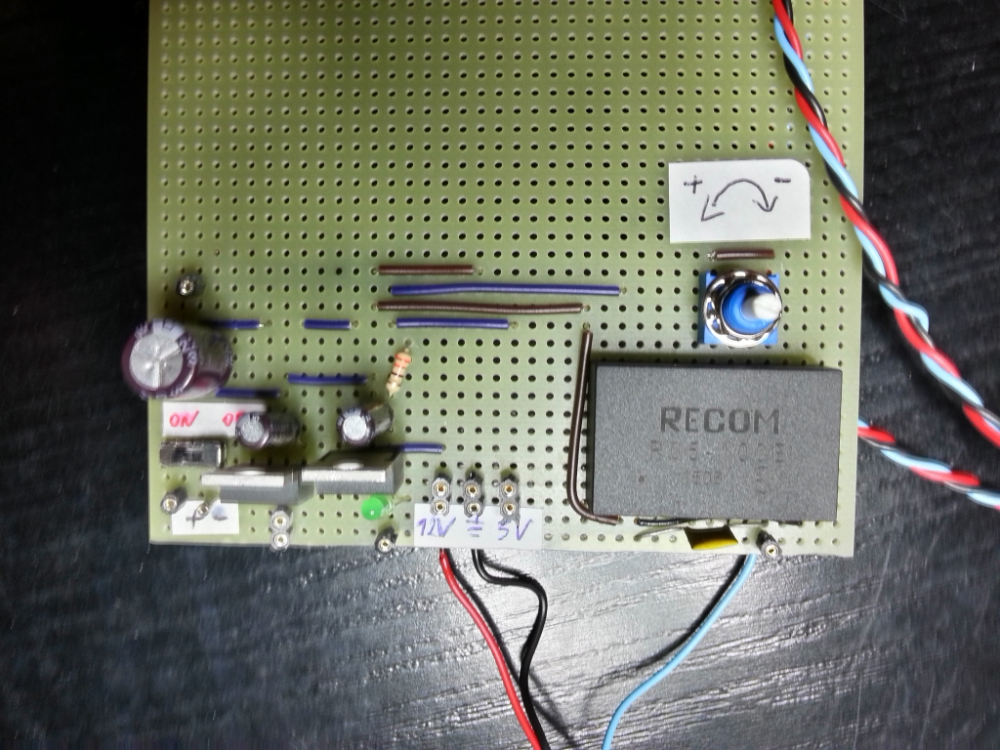

# Module

## Name
[`MDL-alimentation_high_voltage_recom`]()

## Title
High voltage (-100V) alimentation

## Description

version      | V1.1  
------------- | -------------  
date     |18/04/2016  
technology|integrated circuit [`R05-100B`](http://www.digikey.fr/product-detail/fr/recom-power/R05-100B/945-2051-5-ND/3776798)  
author|BM  

## Functions
Function: [`FCT-sensing`](../../functions/FCT-sensing)  
Sub-Function:  [`FCT-emitting`](../../functions/FCT-emitting)  

## IOs
###Inputs
[`ITF-10_gnd`](../../interfaces/ITF-10_gnd)  
[`ITF-B_5v`](../../interfaces/ITF-B_5v) or [`ITF-F_12v`](../../interfaces/ITF-F_12v)  

### Outputs
[`ITF-T_100v`](../../interfaces/ITF-T_100v) variable output: +/-50 to 150V DC  

## Visuals

  
*circuit*  

## Observations

###pros
variable output  
###cons
price  
###constraints
5V or 12V power supply  

