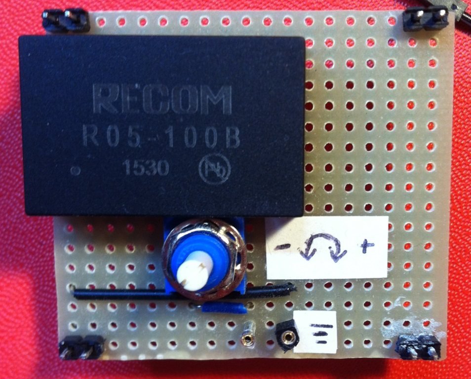

# Module

## Name
[`MDL-alimentation_high_voltage_recom`]()

## Title
High voltage (-100V) alimentation

## Version
V1.1  

## Date
18/04/2016  

## Technology
integrated circuit [`R05-100B`](http://www.digikey.fr/product-detail/fr/recom-power/R05-100B/945-2051-5-ND/3776798)  

## Author
[`BM`](../../contributors/CTB-bm)  

## Functions
[`FCT-emitting`](../../functions/FCT-sensing_emitting)  

## IOs
###Inputs
[`ITF-10_gnd`](../../interfaces/ITF-10_gnd)  
[`ITF-B_5v`](../../interfaces/ITF-B_5v) or [`ITF-F_12v`](../../interfaces/ITF-F_12v)  

### Outputs
[`ITF-T_100v`](../../interfaces/ITF-T_100v) variable output: +/-50 to 150V DC  

## Description

### Module requirements
This module will provide a high voltage negative DC in order to increase the pulse voltage to exite efficiently the transducer.  

### Visuals

  
*circuit*  

### Observations

#### Pros
variable output  
#### Cons
price  
#### Constraints
5V or 12V power supply  

