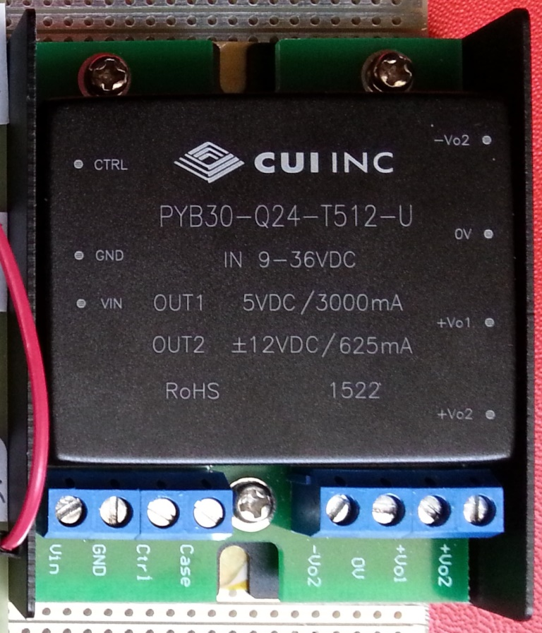

# Module

## Name
[`MDL-alimentation_low_voltage`]()

## Title
Low voltage (+5v, +3.3v, ...) alimentation

## Description
version      | V1.0  
------------- | -------------  
date     |11/04/2016  
technology|hand made  
author|Jérôme/Gérard  

## Functional analysis

### Function 
[`FCT-sensing`](../../functions/FCT-sensing)

### Sub-Function
[`FCT-sensing`](../../functions/FCT-emitting)
[`FCT-sensing`](../../functions/FCT-receiving)
[`FCT-sensing`](../../functions/FCT-sweeping)

### Module requirements
This module will provide the DC alimentation adapted to the electronic circuits different requirements in terms of voltage.

## IOs

### Inputs
* [`ITF-A_gnd`](../../interfaces/ITF-A_gnd)
* [`ITF-L_18v_alimentation`](../../interfaces/ITF-L_18v_alimentation)

### Outputs
* [`ITF-29_5v`](../../interfaces/ITF-29_5v)
* [`ITF-H_neg_12v`](../../interfaces/ITF-H_neg_12v)
* [`ITF-10_gnd`](../../interfaces/ITF-F_12v)

## Visuals
  
*scheme*    

## Observations

### pros
low cost
### cons
18Vpp input
### constraints
NA
