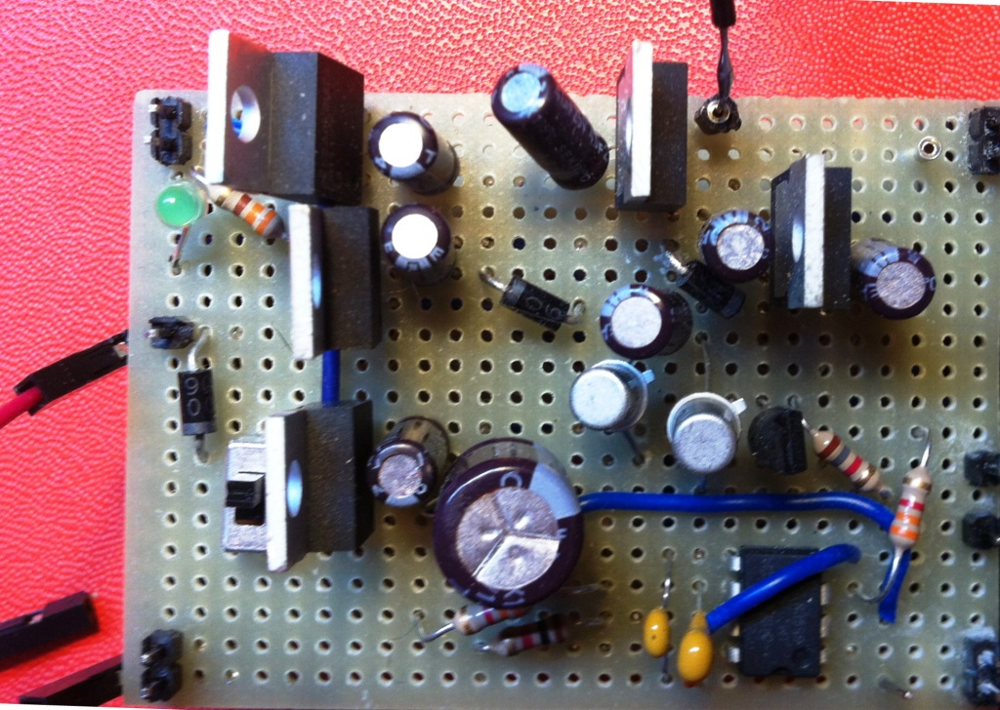

# Module

## Name
[`MDL-alimentation_low_voltage`]()

## Title
Low voltage (+5v, +12v, ...) alimentation home made

## Version
V16.04.11  

## Technology
Echopen Made  

## Contributor

[`Jerome`](../../contributors/CTB-jerome)
[`Gerard `](../../contributors/CTB-gerard)

## Functions
[`FCT-sensing`](../../functions/FCT-sensing)  
[`FCT-signal_processing`](../../functions/FCT-signal_processing)  
 
## IOs

### Inputs
* [`ITF-A_gnd`](../../interfaces/ITF-A_gnd)
* [`ITF-L_18v_alimentation`](../../interfaces/ITF-L_18v_alimentation)

### Outputs
* [`ITF-B_5v`](../../interfaces/ITF-B_5v)
* [`ITF-H_neg_12v`](../../interfaces/ITF-H_neg_12v)
* [`ITF-F_12v`](../../interfaces/ITF-F_12v)

## Description
### Module requirements
This module will provide the DC alimentation adapted to the electronic circuits' different requirements in terms of voltage.

### Visuals
  
*scheme*    

### Observations

#### pros
low cost
#### cons
18Vpp input
#### constraints
NA
