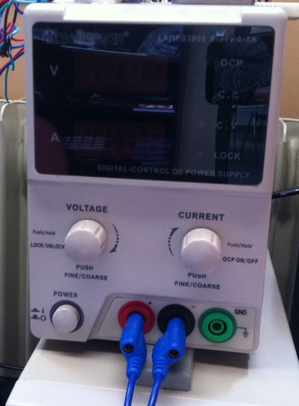

# Module

## Name
[`MDL-battery_lab`]()

## Title
Alimentation

## Version
V16.04.18 

## Technology
Commercial System [`Velleman`](http://www.velleman.eu/products/view/?country=fr&lang=fr&id=417650)

## Functions  
[`FCT-sensing`](../../functions/FCT-sensing)  
[`FCT-user_interfacing`](../../functions/FCT-user_interfacing)  

## IOs
###Inputs
220V

### Outputs
[`ITF-L_18v_alimentation`](../../interfaces/ITF-L_18v_alimentation)  variable stabilized power supply (0 to 30V).

## Information

### Module requirements 
This module will provide DC voltage to the circuit.

### Observations

#### Pros
variable stabilized power supply  
#### Cons
expensive system  
#### Constraints
NA

