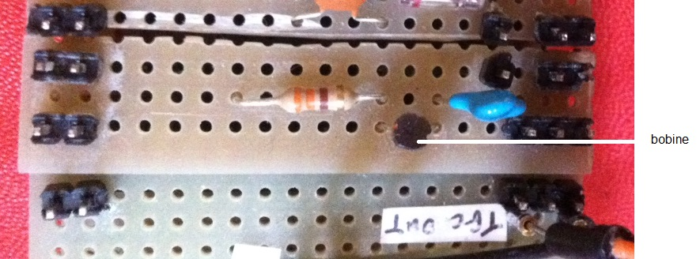

# Module

## Name
[`MDL-band_pass_filter_rcl`]()

## Title
Band-pass filter

## Version
V1.0  

## Date
14/04/2016  

## Technology
Home made
 
## Contributor
[`Jérôme`](../../contributors/CTB-jerome)  
[`Michel`](../../contributors/CTB-michel) 

## Functions
[`FCT-sensing_emitting`](../../functions/FCT-sensing_emitting)  

## IOs

###Inputs
[`ITF-C_amplified_raw_signal`](../../interfaces/ITF-C_amplified_raw_signal)  

### Outputs
[`ITF-D_amplified_filtered_signal`](../../interfaces/ITF-D_amplified_filtered_signal)  

## Description

### Module requirements
This module will filter the noise from the raw signal coming out of the TGC.

### Visuals
  
*circuit*    

### Observations

#### Pros
very simple

#### Cons
NA  

#### Constraints
NA
 
