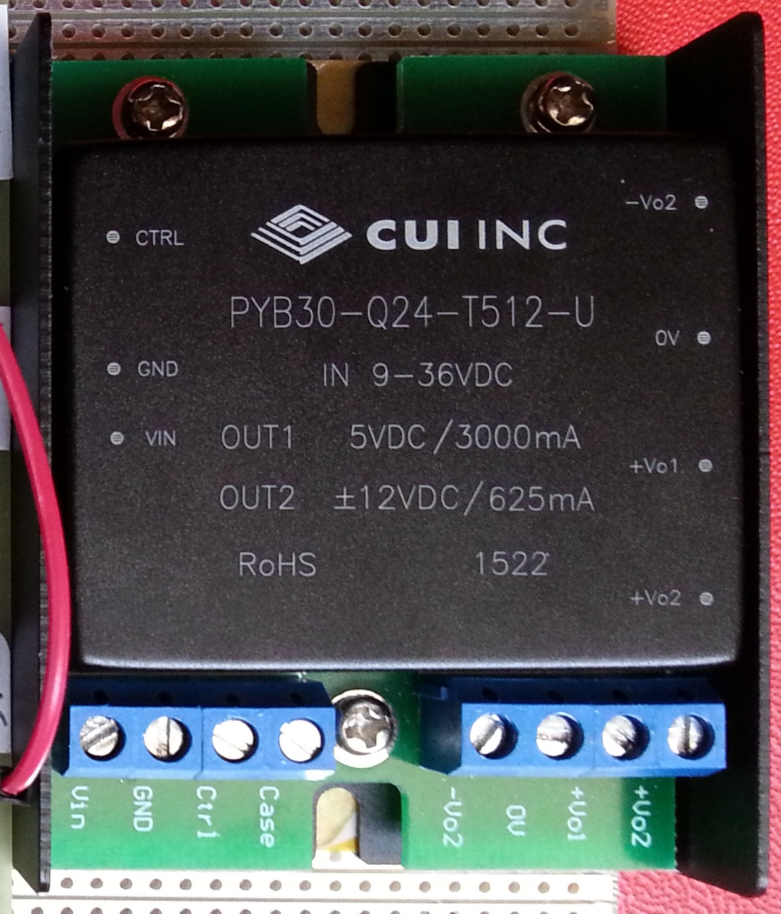

# Module

## Name
[`MDL-alimentation_low_voltage`]()

## Title
Low voltage (+5v, +3.3v, ...) alimentation

## Description
We need to split the tension provided by the lab alimentation  because each circuit used for different sub-functions needs a different value of DC alimentation.  

## Uses
* external +18v

## Produce
* [`ITF-10_gnd`](../../interfaces/ITF-10_gnd)
* [`ITF-29_5v`](../../interfaces/ITF-29_5v)

## Functions
Function: [`FCT-alimentation`](../../functions/alimentation)

## Solutions  

###Home Made  

version      | V1.0  
------------- | -------------  
date     |11/04/2016  
technology|home made 
author|Farad/Jérôme

#### Visuals:
  
  

Input/Output:  
**input**: 18V CC  
**output**: +/- 12V, + 5V  

Pros/Cons/Constraint: 
**pros**: low cost  
**cons**: 18V CC as input voltage  
**constraint**: NA  

###Integrated circuit 

version      | V1.1  
------------- | -------------  
date     |18/04/2016  
technology|commercial circuit 
author|BM

#### Visuals:
  
  
[PYB30-Q24](http://www.cui.com/product/resource/pyb30-u.pdf)  

###Input/Output:
**input**: 9 to 36 V CC  
**output**: +/- 12V, +5V  

###Pros/Cons/Constraint: 
**Pros**: NA  
**Cons**: price  
**Constraint**:  9 to 36 V CC  

