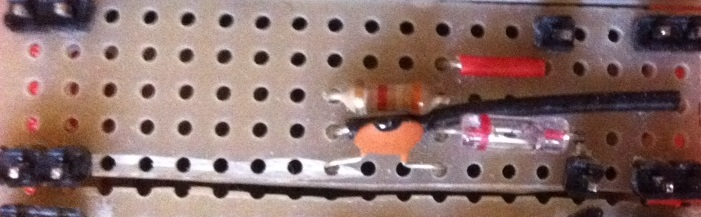

# Module

## Name
[`MDL-envelope_detector_demodulator`]()

## Title
Envelope detector

## Version
V16.04.08  

## Technology
Echopen Made

## Contributor
[`Farad`](../../contributors/CTB-Farad)  

## Functions  
[`FCT-signal_processing_envelop_detecting`](../../functions/FCT-signal_processing_envelop_detecting)  

## IOs
###Inputs
[`ITF-D_amplified_filtered_signal`](../../interfaces/ITF-D_amplified_filtered_signal)  

### Outputs
[`ITF-E_signal_envelope`](../../interfaces/ITF-E_signal_envelope)  

## Description

### Module requirements 
The acoustic image is given by the value of the acoustic intensity on each point. 
This amplitude is given by the envelope of the acoustic echoes.
This module will extract the envelope from the filtered signal.

## Visuals 

### Observations

#### Pros
simple

#### Cons
the envelope is detected only for the positive value of the signal, 
so the envelpe decrease between each positive lobs of the echoes.  

#### Constraints

NA 

