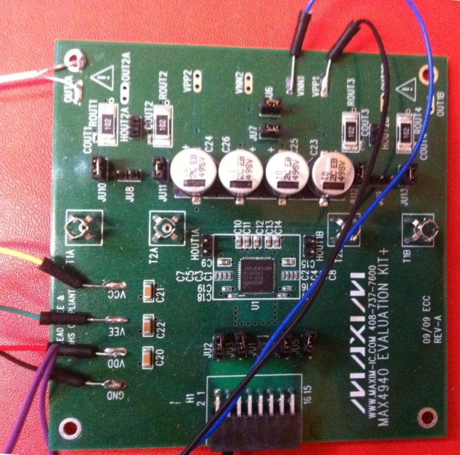

# Module
  

## Name
[`MDL-pulser_maxim`]()  

## Title
Maxim pulser producing a high voltage (-100v) pulse 

## Version
V16.04.12  

## Technology
integrated circuit [`MAX4940`](http://www.mouser.com/ds/2/256/MAX4940EVKIT-MAX4940MB-477818.pdf)
 
## Author
[`BM`](../../contributors/CTB-bm)  

## Functions
[`FCT-sensing_emitting`](../../functions/FCT-sensing_emitting)  

## IOs

###Inputs

[`ITF-A_gnd`](../../interfaces/ITF-A_gnd)    
[`ITF-I_pulse_on`](../../interfaces/ITF-I_pulse_on)  
[`ITF-J_pulse_off`](../../interfaces/ITF-J_pulse_off)  
[`ITF-F_12v`](../../interfaces/ITF-F_12v)  
[`ITF-H_neg_12v`](../../interfaces/ITF-H_neg_12v)  
[`ITF-B_5v`](../../interfaces/ITF-B_5v)  
[`IM-A_100v`](../../interfaces/IM-A_100v)  

### Outputs
[`IM-B_100v_pulse`](../../interfaces/IM-A_100v_pulse)  

## Description

### Module requirements
This module will provide a high voltage pulse that will excite the transducer.

### Visuals
  
*circuit*    

### Observations

#### Pros
NA

#### Cons
cost, size

#### Constraints
need +/- 12V and 5V alimentation for the MOSFET

