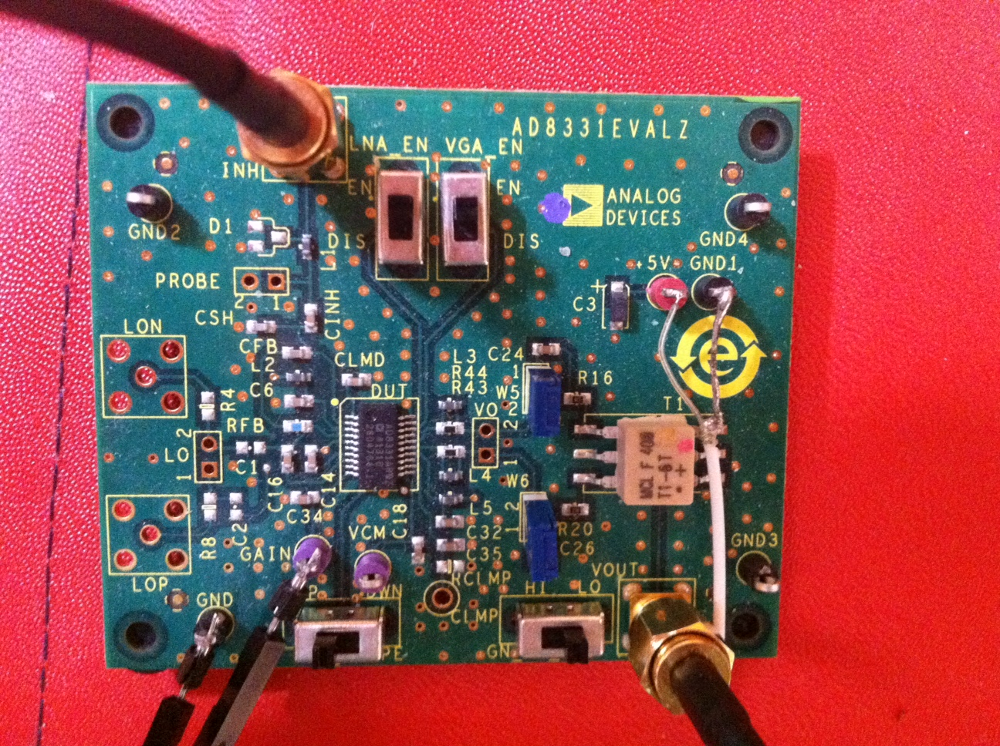

# Module

## Name
[`MDL-tgc_analog_devices`]()

## Title
Time Gain Amplification

## Version
V1.0  

## Date
12/04/2016  

## Technology
Integrated circuit [`AD8331 EVALZ`](AD8331 EVALZ)

## Contributor
[`XXXX`](../../contributors/CTB-XXXX)  

## Functions  
[`FCT-signal_processing_amplifying_time_gain_compensation`](../../functions/FCT-signal_processing_amplifying_time_gain_compensation)  

## IOs
###Inputs
[`ITF-B_5v`](../../interfaces/ITF-B_5v)  
[`ITF-A_gnd`](../../interfaces/ITF-A_gnd)  
[`echo reçu`](../../interfaces/ITF-IM-C_echo_recu) 
[`commande TGC redpitaya`]((../../interfaces/ITF-CMD-A_tgc_redpitaya) 

### Outputs
[`ITF-C_amplified_raw_signal`](../../interfaces/ITF-C_amplified_raw_signal)  

## Description

### Module requirements 
The living tissues attenuate the acoustic wave that propagates inside them. 
In order to compensate this attenuation the module will amplify the received echoes gradually with the time.

### Observations

#### Pros
high amplification factor accessible  

#### Cons
takes a lot of space (evaluation kit)   
#### Constraints
5V alimenation and a ramp from 0 to 1V to modify the gain of the VGA  

