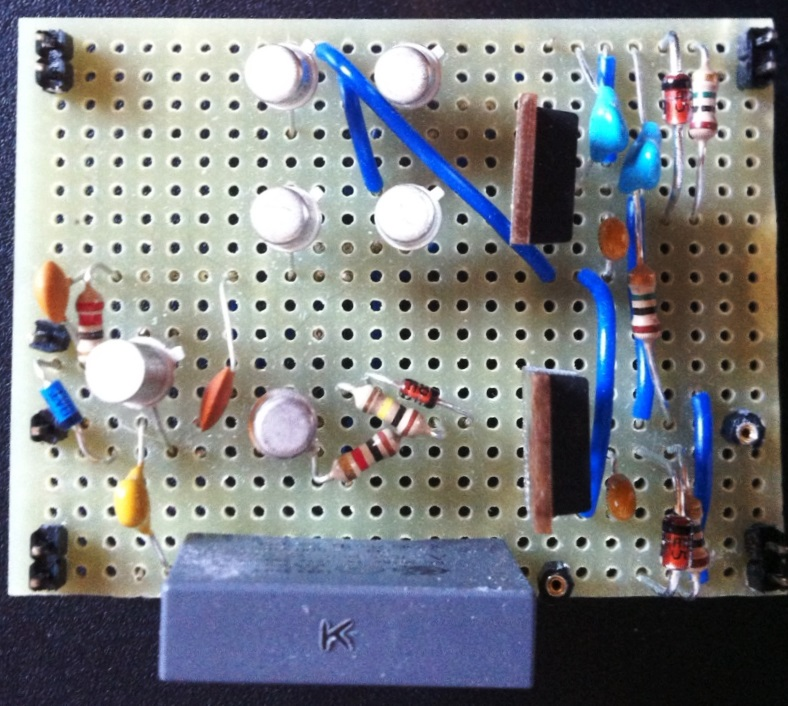

# Module
  

## Name
[`MDL-pulser_home_made`]()  

## Title
Pulser producing a high voltage (-100v) pulse

## Version
V1.0  

## Date
12/04/2016  

## Technology
hand made  
 
## Author
[`Gérard`](../../contributors/CTB-gerard)  
[`Michel`](../../contributors/CTB-michel) 

## Functions
[`FCT-sensing_emitting`](../../functions/FCT-sensing_emitting)  

## IOs

###Inputs
[`ITF-F_12v`](../../interfaces/ITF-B_5v)  
[`ITF-T_100v`](../../interfaces/ITF-T_100v)  
[`ITF-I_pulse_on`](../../interfaces/ITF-I_pulse_on)  
[`ITF-J_pulse_off`](../../interfaces/ITF-J_pulse_off)  

### Outputs
[`ITF-U_100v_pulse`](../../interfaces/ITF-U_100v_pulse)  

## Description

### Module requirements
This module will provide a high voltage pulse that will excite the transducer.

### Visuals
  
*circuit*    

### Observations

#### Pros
NA

#### Cons
The pulse can be smaller (in time) than the logic pusle due to self effect of the cable going to the transducer
It worked perfectly on the initial board though.

#### Constraints
Need 12V alimentation for the MOSFET
 

